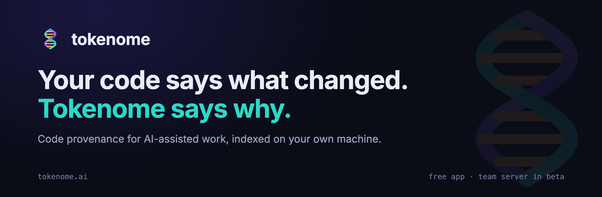
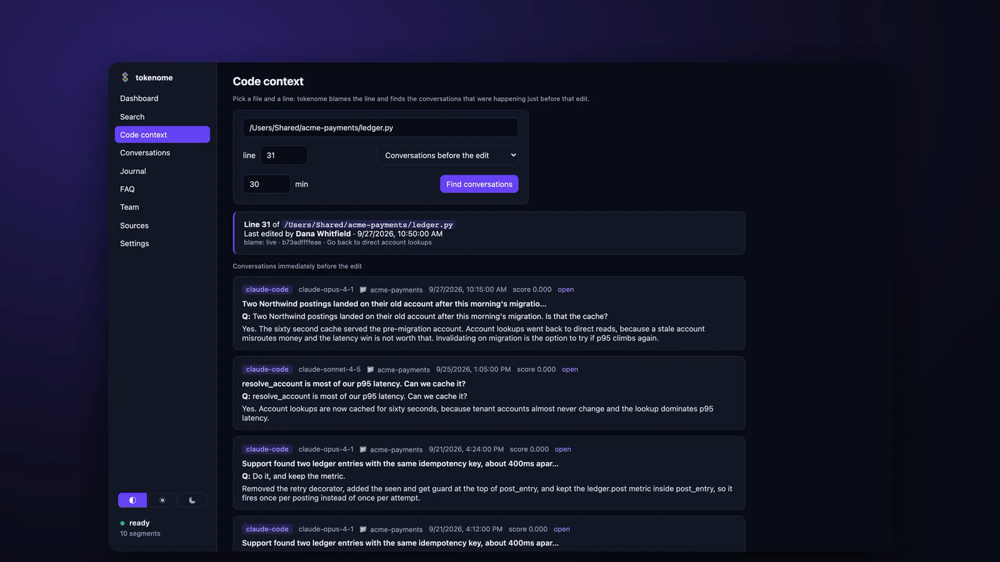
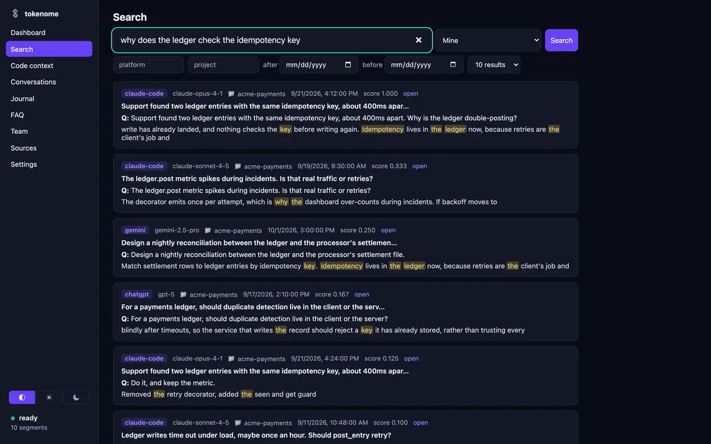
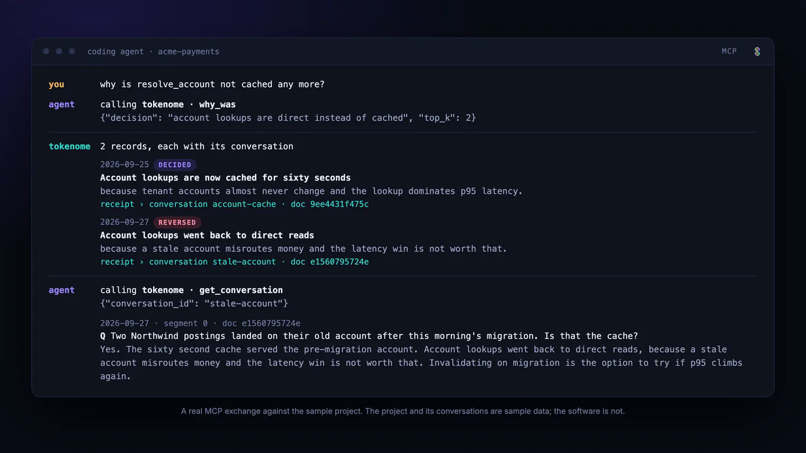
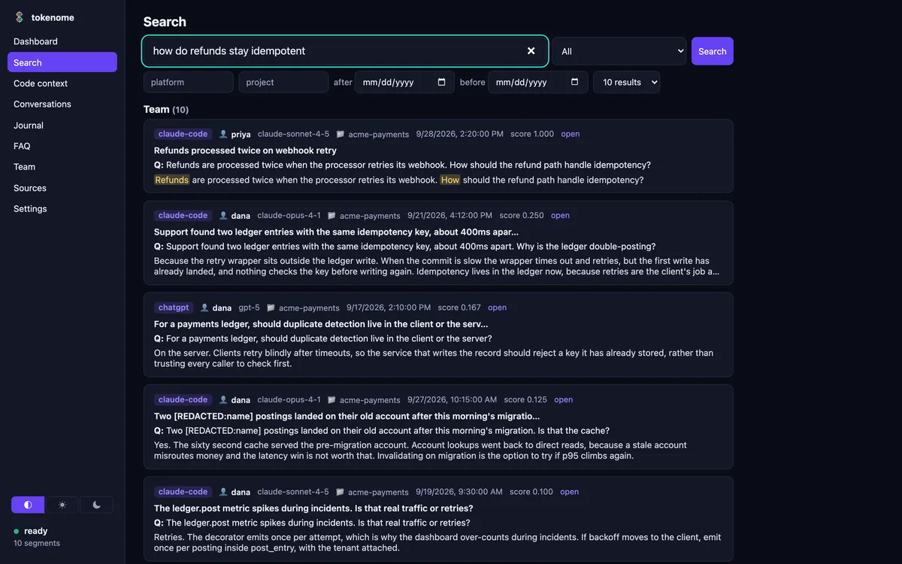

<p align="center">
  
</p>

<p align="center">
  <a href="https://github.com/tokenome/releases/releases/latest"></a>
  <a href="https://pypi.org/project/tokenome-ai/"></a>
  
  <a href="LICENSE"></a>
</p>

<p align="center">
  <b><a href="https://tokenome.ai">Website</a></b> &nbsp;&middot;&nbsp;
  <b><a href="https://tokenome.ai/docs/">Docs</a></b> &nbsp;&middot;&nbsp;
  <b><a href="https://tokenome.ai/team">Team server</a></b> &nbsp;&middot;&nbsp;
  <b><a href="https://github.com/tokenome/releases/releases/latest">Downloads</a></b> &nbsp;&middot;&nbsp;
  <b><a href="https://github.com/tokenome/releases/issues">Issues</a></b>
</p>

---

Most of the reasoning behind your code now happens in a chat with an AI, and it
stays trapped there. Git blame tells you who touched a line. It cannot tell you
why the line looks the way it does.

Tokenome captures your conversations with AI coding tools, Claude Code, Claude
Desktop, ChatGPT and Gemini, indexes them on your own machine, and links every
line of code to the conversation that produced it.

This repository is where tokenome is **distributed**: the desktop app builds,
the command-line package, the Claude Code plugin marketplace, and the team
server image with its deployment bundle. There is no source code here.

## Install

Pick one. They are the same product.

**Desktop app.** Download from the
[latest release](https://github.com/tokenome/releases/releases/latest), open it,
and you are done. The index, the embedding model and the search engine are all
inside the download, so nothing is fetched on first run.

**Command line.** Any machine with [uv](https://docs.astral.sh/uv/):

```bash
uv tool install tokenome-ai
```

**Claude Code plugin.** So your agent can look up your history itself:

```
/plugin marketplace add tokenome/releases
/plugin install tokenome@tokenome
```

## What you get

### Point at a line, get the argument behind it

Pick a file and a line. Tokenome blames the line, finds the commit, and brings
back the conversations from just before that edit, including the ones where a
change was tried and reversed.



### Ask in plain language

Search by meaning as well as by keyword, from the app, the command line, or an
agent over MCP.



### Your agent can ask too

Tokenome is an MCP server. Claude Code looks the history up itself and gets the
answer with the conversation it came from, instead of asking you to explain it
all again.



### One search across a team

With the team server, one search covers everyone's opted-in projects, and every
answer carries the name of the person whose conversation it came from.



### And every day, a journal

Once a day tokenome writes down what was decided and why, quoting the turn each
reason came from, and marking a reversal as a reversal.

## Downloads

| Platform | File | Notes |
|---|---|---|
| macOS, Apple Silicon (13 or later) | `tokenome_<version>_aarch64.dmg` | Signed and notarized. Open the DMG and drag tokenome to Applications. |
| Linux x86_64 | `tokenome_<version>_amd64.AppImage`, `tokenome_<version>_amd64.deb` | The AppImage is the form the in-app updater can replace. |
| Linux aarch64 | `tokenome_<version>_aarch64.AppImage`, `tokenome_<version>_arm64.deb` | Same. |

A `.sha256` file accompanies every download. The `.sig` files and `latest.json`
belong to the in-app updater, and `THIRD_PARTY_LICENSES.md` lists the
open-source components each build contains. The app installs a `tokenome`
command at `~/.local/bin/tokenome` that uses its own runtime.

There is no Intel Mac build and no Windows build at present. If you would like
either one, [file or vote on an issue](https://github.com/tokenome/releases/issues).

The package on PyPI is `tokenome-ai`; the command is `tokenome`. The same wheels
are attached to every release. If the desktop app is installed on the same
machine, installing the wheel replaces the app's `tokenome` command with the
wheel's own; keep one or the other.

The two "Source code" entries GitHub attaches to every release are archives of
this repository's own files, not the app's source, which is not published.

## Privacy

Everything runs on your machine: the index, the embedding model, the search
engine. The app's only outbound connection is a check against this repository
for new releases, and nothing is installed without your confirmation. It sends
no conversations and no code.

If you join a team server, what leaves a laptop is what that person opts in to
share, with secrets redacted before it goes, and it goes to a server your own
organization runs. We never train on your data.

## Team server

The desktop app is **free**. Not a trial, and not a free tier with a clock on
it.

The team server is the product a team runs for itself: a service on your own
infrastructure so everyone can search across opted-in projects with attribution,
with an admin console for people, devices, sharing coverage and an append-only
audit log. Tokenome does not host it and receives none of your data.

**Team is in beta, and free.** There is no key to install, no seat limit and
nothing enforced. Every team on the beta will be told at least 30 days before
any charging starts, and the list price is published at
[tokenome.ai](https://tokenome.ai).

It ships as a container image, `ghcr.io/tokenome/tokenome-server:<version>`, and
this repository's [`deploy/`](deploy/) folder is the bundle that runs it: a
compose file pinned to the latest release, Caddy for TLS, and the runbook.
Setup instructions are in the [docs](https://tokenome.ai/docs/team).

## Support

- Bugs and questions about the app: [open an issue](https://github.com/tokenome/releases/issues).
- Security: see [SECURITY.md](SECURITY.md).
- Everything else: **hello@tokenome.ai**.

## License

- **Desktop app:** proprietary, free of charge, under the terms in
  [LICENSE](LICENSE). The open-source components it bundles are listed, with
  their licenses, in `THIRD_PARTY_LICENSES.md` on every release.
- **Command-line package (`tokenome-ai`, `tokenome-core`) and the Claude Code
  plugin:** Business Source License 1.1. Use, modify and redistribute, including
  in production, except to offer a competing product; each version converts to
  the Apache License 2.0 four years after it is published. The text ships inside
  the packages and at [`plugins/claude/LICENSE`](plugins/claude/LICENSE).
- **Team server:** proprietary, licensed separately under the Tokenome Team
  terms.

The same terms, in a form built for reading, are published at
[tokenome.ai/terms](https://tokenome.ai/terms).
